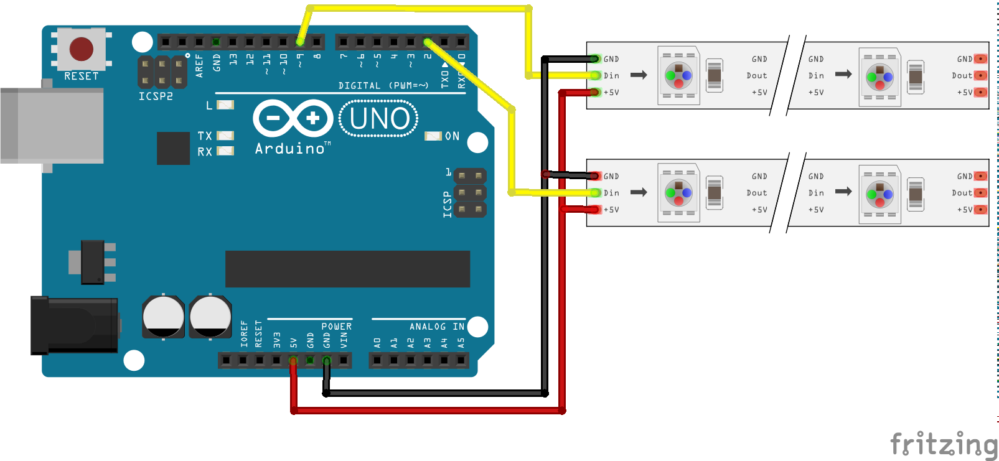

# Multi strip example

This example uses johnny five to control multiple WS2812 strips using a custom
firmata. These can be defined to work on any digital pin (except 0 & 1).

To install the custom firmata, see the [Installation Guide](installation.md).

## Wiring

Wire the neopixel strip up as shown below.



## Example code

```js
var five = require("johnny-five");
var { Strip } = require("node-pixel-async");

var opts = {};
opts.port = process.argv[2] || "";

var board = new five.Board(opts);
var strip = null;

var fps = 20; // how many frames per second do you want to try?

board.on("ready", function() {

    console.log("Board ready, lets add light");

    strip = Strip({
        board: this,
        controller: "FIRMATA",
        strips: [ {pin: 9, length: 8}, {pin: 2, length: 17},]
    });

    strip.on("ready", function() {

        console.log("Strip ready");

        var colors = ["red", "green", "blue"];
        var current_colors = [0,1,2];
        var current_pos = [0,1,2];
        var blinker = setInterval(function() {

            strip.color("#000"); // blanks it out
            for (var i=0; i< current_pos.length; i++) {
                if (++current_pos[i] >= strip.length) {
                    current_pos[i] = 0;
                    if (++current_colors[i] >= colors.length) current_colors[i] = 0;
                }
                strip.pixel(current_pos[i]).color(colors[current_colors[i]]);
            }

            strip.show();
        }, 1000/fps);
    });

    strip.on("error", function(err) {
        console.log(err);
        process.exit();
    });
});
```

## Running

To run the example:

```
node examples/multipin.js
```

You can optionally pass a port in as a parameter.
